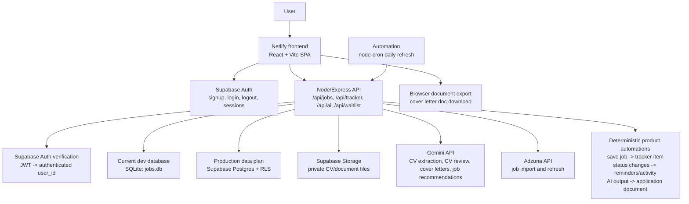

# ApplyWise Architecture

Date: 2026-07-03

## Overview

ApplyWise is a React/Vite web app with an Express API, Supabase authentication, local SQLite development storage, Gemini AI features, and Adzuna job ingestion. The frontend should be deployed on Netlify. The backend should run as a separate Node service unless it is later converted into serverless functions.

## Architecture Diagram

## Frontend

Location: `client/`

Responsibilities:

- Render the public waitlist, login, signup, and authenticated app screens.
- Keep demo-mode browsing available without login.
- Attach Supabase access tokens to API calls when a user is signed in.
- Show account-required messages when demo users try to store data.
- Display jobs, tracker records, documents, Personal Information, coach views, and reminders.
- Export generated cover letters as document files in the browser.

Deployment:

- Host the frontend on Netlify.
- Build command: `npm run build --workspace=client`.
- Publish directory: `client/dist`.
- Required frontend env vars: `VITE_SUPABASE_URL`, `VITE_SUPABASE_PUBLISHABLE_KEY`.

## Backend API

Location: `server/`

Responsibilities:

- Serve REST API endpoints.
- Verify Supabase sessions through the Supabase Auth API.
- Keep secrets out of frontend code.
- Read and write jobs, tracker records, waitlist entries, and Personal Information.
- Call Gemini and Adzuna.
- Serve the built frontend in production-style local runs when `client/dist` exists.

Main routes:

- `/api/waitlist`: public waitlist signup and local waitlist stats.
- `/api/jobs`: public job list, user-created jobs where applicable, authenticated refresh.
- `/api/tracker`: authenticated application tracker reads and writes.
- `/api/personal-information`: authenticated CV-derived profile storage.
- `/api/ai`: Gemini-backed CV review, CV extraction, cover letter generation, and job recommendations.

## Database

Current local implementation:

- SQLite file: `server/db/jobs.db`.
- Tables: `jobs`, `tracker`, `waitlist_signups`, `personal_information`.

Production target:

- Supabase Postgres using migrations under `supabase/migrations/`.
- Row-level security on all user-owned data.
- Public jobs readable by anonymous and authenticated users.
- User-owned applications, reminders, documents, AI artifacts, and Personal Information readable and writable only by the owner.
- Private document files stored in Supabase Storage under user-owned paths.

## AI Layer

Provider:

- Gemini API via `server/services/gemini.js`.

AI tasks:

- CV review for a selected job.
- CV extraction into structured Personal Information.
- Cover letter generation for a selected application.
- Job recommendations from the current job list based on saved Personal Information.

Guardrails:

- AI receives only the relevant CV/profile, job, and application context.
- Prompts instruct the model not to invent experience, metrics, grades, languages, employers, or certifications.
- Structured JSON schemas are used for outputs.
- User approval remains required before CV suggestions or generated text become application material.

## Job Data

Sources:

- Adzuna API for external job listings.
- Seed/manual jobs for local and demo use.
- User-created manual jobs after login.

Automation:

- On server startup, fetch from Adzuna when the jobs table is empty and API keys exist.
- Daily refresh at 06:00 through `node-cron`.
- Background resolution of Adzuna redirect URLs where possible.
- Off-target roles are filtered out by classifier logic.

## Product Automations

Current and planned deterministic automations:

- Saving a job creates a tracker application in `Saved` status.
- Duplicate job saves return the existing tracker item.
- Status updates are scoped to the authenticated user.
- Saving CV recommendations updates application document readiness.
- Saving a cover letter stores it on the selected application and marks document readiness.
- Jobs page requests AI recommendations after saved Personal Information exists.
- Home and Reminders surface deadlines, follow-ups, interview prep, missing documents, and weekly application goals.

## Security And Privacy

- Frontend never stores Gemini or Adzuna secrets.
- Supabase publishable keys may be present in frontend environment variables.
- API routes use bearer tokens to resolve the authenticated Supabase user.
- Every user-owned database query must filter by `user_id`.
- CVs, Personal Information, AI artifacts, and application notes are private user data.
- The app should support GDPR expectations: clear consent, data export, account deletion, and minimal data retention.

## Deployment Notes

Recommended production layout:

- Netlify: frontend static hosting.
- Render, Railway, Fly.io, or equivalent: Express API.
- Supabase: Auth, production Postgres, private document storage.
- Gemini: AI features.
- Adzuna: job search data.

The Vite local proxy should be replaced with a deployed API base URL for Netlify builds.
